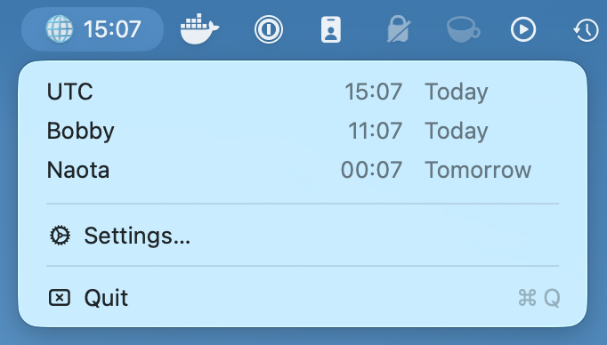
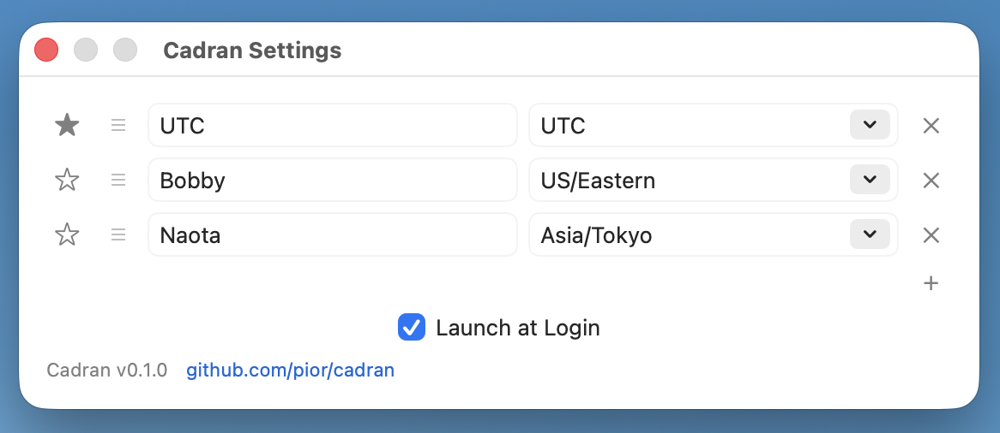

# Cadran

A lightweight multi-timezone macOS menu bar app.




## Features

- Lives in the menu bar with no dock icon
- Shows the current time for your favorite timezone at a glance
- Dropdown displays saved timezones with custom labels, current time, and relative day context
- Marks relative days as Today, Tomorrow, or Yesterday when the saved timezone is on an adjacent local date
- Preferences window for adding, removing, editing, favoriting, and reordering timezone entries
- Timezone picker accepts city-style search results, IANA IDs, UTC offsets, and timezone abbreviations
- Launch at Login toggle in preferences
- Very light CPU usage
- Persists your timezone list across restarts using macOS user defaults
- Native macOS app with no Electron, webview, or heavy runtime

## Install

Download the latest release from the [Releases page](https://github.com/pior/cadran/releases):

- Apple Silicon: `Cadran-macos-aarch64.zip`
- Intel: `Cadran-macos-x86_64.zip`

Unzip and drag `Cadran.app` into `/Applications`.

Requires macOS 13 or later.

## Build from source

Requires Rust 1.95+.

```
git clone https://github.com/pior/cadran.git
cd cadran
cargo run
```

To build and install a `.app` bundle into `/Applications` (via [DevBuddy](https://github.com/devbuddy/devbuddy)):

```
bud install
```

## Status

Early development.

## License

[MIT](LICENSE)
